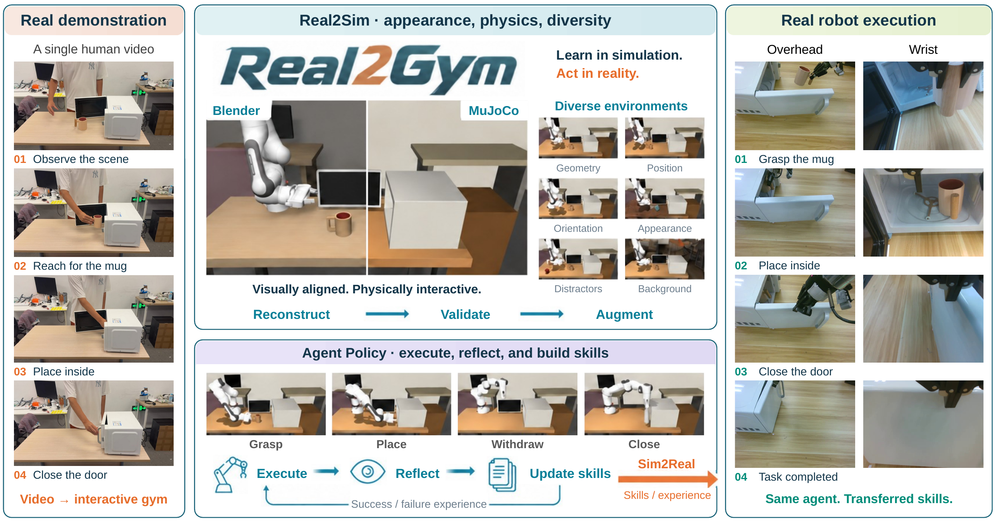
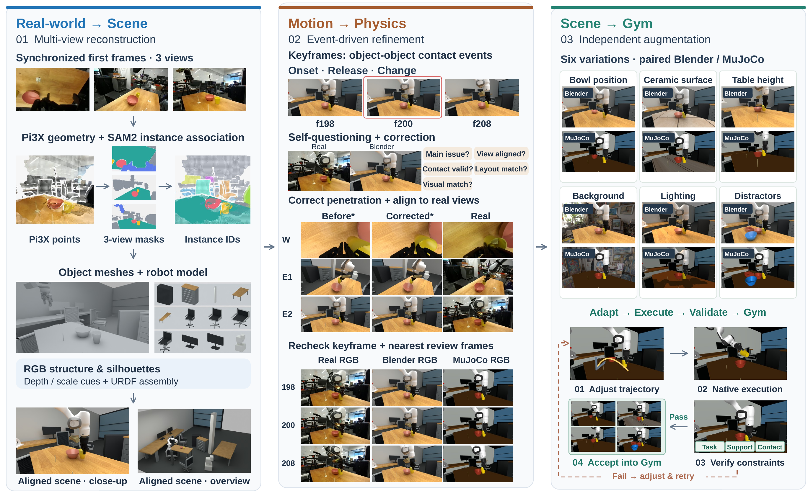

# Real2Gym: Building Gyms from Videos, Bringing Skills to Robots

**[🌐 Project website & demos](https://real2gym.github.io/)** · **[Real2Sim](https://github.com/real2gym/Real2Gym)** · **[Agent](https://github.com/real2gym/R2G_Agent)** · **[Paper](https://github.com/real2gym/Real2Gym/blob/main/paper/Real2Gym.pdf)**

[Kerui Ren](https://scholar.google.com/citations?user=5kW5apkAAAAJ)\*, [Yingxiang Xu](https://github.com/LeoX0808)\*, Kaiwen Song, [Linning Xu](https://eveneveno.github.io/lnxu/), [Bo Dai](https://daibo.info/), [Mulin Yu](https://scholar.google.com/citations?user=w0Od3hQAAAAJ)†, [Tao Lu](https://scholar.google.com/citations?user=Ch28NiIAAAAJ)†

\* 共同第一作者。† 通讯作者。

**中文** | [English](../README.md)

**从人手或机器人视频，构建场景、执行动作，再生成有验证证据的仿真变体。**

Real2Gym 由 **GPT6 Astra** 协调 **Blender 场景重建、MuJoCo 动作执行与反馈迭代**。

## 核心能力

- **人手与机器人输入**：支持单视角、多视角视频，并将动作重定向到选定硬件。
- **场景与动作对齐**：重建物体、机器人和相机，逐交互关键帧复核并修正。
- **原生物理验证**：在 MuJoCo 执行任务，将结果与对应模型、轨迹及证据关联。
- **可执行场景增强**：调整几何、目标位置、桌高、背景和外观，适配动作后逐场景复验。

## 三步流程

| 步骤 | 工作 | 输出 |
| --- | --- | --- |
| **1. 重建** | 几何初始化、完整物体建模、与视频对齐 | Blender 场景、机器人与相机 |
| **2. 执行** | 动作恢复／重定向、接触调整、完整物理回归 | MuJoCo 模型、原生轨迹、**Real / Blender / MuJoCo RGB** 对照 |
| **3. 增强** | 组合机械变化与外观变化，逐项验证 | 带参数差异及运行证据的仿真场景集合 |

## 快速使用

克隆 [Real2Gym](https://github.com/real2gym/Real2Gym)，将完整 `skills/real2sim-prompt` 目录安装到 agent 技能目录。Codex 默认位置为 `~/.codex/skills/real2sim-prompt`，调用名称为 **`$real2sim-prompt`**。

使用 Conda 创建 `real2gym` 环境（Python 3.11），命令见[英文快速开始](../README.md#get-started)。按[环境准备指南](guides/getting-started.md)配置 Blender、MuJoCo、几何模型和机器人资产，然后向 agent 提供视频路径、输入类型、目标硬件和输出目录。[示例请求](../examples/README.md)

## 硬件选择

人手示范可选择目标机器人进行动作重定向；同硬件机器人示范沿用源机器人。

<table>
<tr>
<td align="center" width="33%"> <b>Dual FR3 + Franka Hand</b></td>
<td align="center" width="33%"> <b>Dual FR3 + Wuji Hand</b></td>
<td align="center" width="33%"> <b>Dual FR3 + Sharpa Wave</b></td>
</tr>
<tr>
<td align="center" width="33%"> <b>ALOHA 2</b></td>
<td align="center" width="33%"> <b>G1 + Dex3-1</b></td>
<td align="center" width="33%"> <b>H1-2 + stock five-finger hands</b></td>
</tr>
</table>

- **平行夹爪**：双 FR3 + Franka Hand、ALOHA 2。
- **灵巧手**：双 FR3 + Wuji Hand、Sharpa Wave。
- **人形机器人**：G1 + Dex3-1、H1-2 + 自带五指手。
- **自定义硬件**：提供完整 URDF/MJCF 与末端描述。

[配置细节与末端选项](../skills/real2sim-prompt/references/target-robot-selection.md) · [模型图来源](../assets/hardware/README.md)

[引用方式](../README.md#citation)

## 致谢

感谢 **GPT6 Astra** 在 Real2Gym 开发与迭代中的协助，也感谢以下项目提供的思路与参考实现：

- [GPT6-real2sim](https://github.com/lingxiao-guo/GPT6-real2sim)
- [Real2Sim_GPT6_ASTRA](https://github.com/hku-sail/Real2Sim_GPT6_ASTRA)
